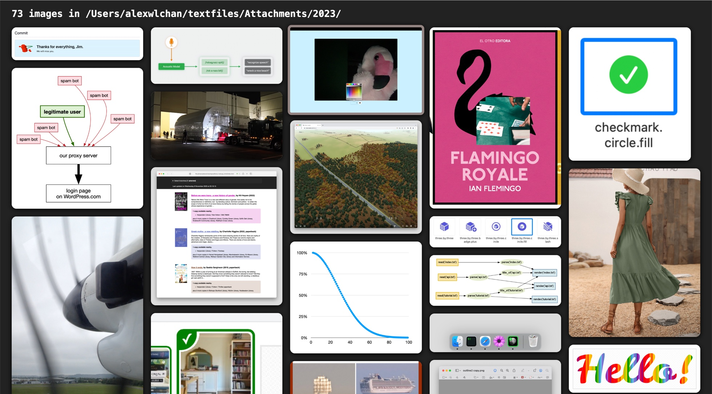

# masonry-viewer

This is a small Python web app that takes a local folder of images, and renders them in a "Masonry" layout.



I made it after reading about the proposal for CSS Grid Level 3, aka "Masonry" layout, on [the WebKit blog](https://webkit.org/blog/15269/help-us-invent-masonry-layouts-for-css-grid-level-3/).
I wanted to experiment with the new layout options.

## Installation

```console
$ git clone https://github.com/alexwlchan/masonry-viewer.git
$ cd masonry-viewer
$ python -m venv .venv
$ source .venv/bin/activate
$ pip install -e .
```

## Usage

```console
$ pip install -e .
$ ROOT=/path/to/images/ python3 -m flask --app "masonry_viewer:app" run
```

## License

MIT.
